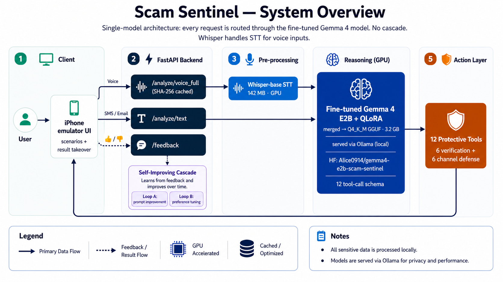
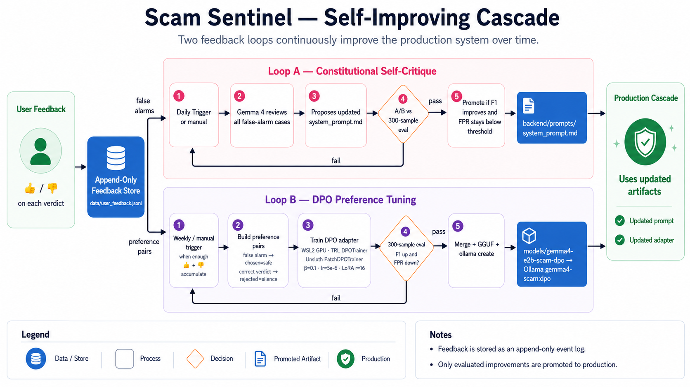

# Scam Sentinel — Stop the Next Victim

## TL;DR

- **Scam Sentinel is an on-device panic-interruption system for scam prevention.**
- It uses a **fine-tuned Gemma 4 E2B** model to analyze SMS, email, voice-call transcripts, and MMS image text **locally**.
- When risk is high, it **takes over the full phone screen**, explains the danger in plain language, and triggers protective tools — blocking, trusted-contact alerts, callback verification, and a 2-minute wait timer.
- The fine-tuned model achieves **98.0% precision** and reduces **false positives to 1.1%** on a 300-sample real-world evaluation set.
- The goal is simple: **stop the user before they panic-click, panic-reply, or panic-send money.**

> *"Scammers don't need your password. They need your panic."*
> Scam Sentinel takes over the screen, slows the clock, and gives the user back the seconds they need to think.

---

## Why this wins — four dimensions in one project

Scam Sentinel is built to satisfy **four winning frames simultaneously**, not pick one:

| Dimension | What Scam Sentinel proves |
|---|---|
| 🎯 **Product impact** | Tackles a problem where older adults and vulnerable populations actually lose money — **$2.9 B from Americans 60+ in 2024 (FTC)**, **$10 B total**, **$1 T+ globally**. Targets the demographic least likely to install paid cloud protection. |
| 🧠 **Technical depth** | QLoRA fine-tune of **Gemma 4 E2B** via Unsloth + TRL. Drives F1 from **58.0 → 86.1** and **FPR from 97.7% → 1.1%** vs. the same-size base — a **+28.1 F1 pt** gain and **88× FPR reduction** on a 300-sample real-world test set. Full reproducible pipeline: Colab L4 SFT → WSL2 merge → llama.cpp GGUF → Ollama Hub. |
| 🛡️ **Safety & Trust** | **All analysis is on-device.** Sensitive messages, voice transcripts, emails, and image text never leave the phone. No cloud account, no API key, no signal required. Every verdict is grounded with the exact phrases that triggered it; limits are documented openly. |
| 📱 **Real-world UX** | In a high-risk situation, Scam Sentinel does not show a small banner — it executes a **full-screen intervention** that physically replaces the scammer's call-to-action with the protective one (Hang up · Block sender · Notify family · 2-min wait timer). The interrupt is the product. |

This is the **Gemma 4 Good Hackathon** submission for **Main Track + Safety & Trust Impact Track**, with concurrent eligibility for **Ollama**, **Unsloth**, and **llama.cpp** Special Technology Tracks.

> **This is not a final forensic deepfake detector. It is a multimodal scam risk assistant that combines phone-call transcript analysis, conversation patterns, and verification workflows.**

---

## Latest update (2026-05-14)

- **QLoRA fine-tuning shipped** — Gemma 4 E2B-it via Unsloth on Colab Pro L4 (~50 min, 2 epochs, LoRA r=16)
- **F1 86.1% / FPR 1.1%** on 300-sample real test set
- **+28.1 F1 pt vs same-size E2B base** (58.0 → 86.1); **88× FPR reduction** (97.7% → 1.1%)
- **Beats larger E4B base** (~8B): +22.7 F1 pt with a ~5B fine-tuned model
- **Adapter published**: [Alice0914/gemma4-e2b-scam-sentinel](https://huggingface.co/Alice0914/gemma4-e2b-scam-sentinel) (~110 MB LoRA)
- **Single-model architecture** — every request goes directly to fine-tuned Gemma 4 (no Stage 1 cascade).
- **Local-first serving** — LoRA merged into the base, converted to a 3.2 GB Q4_K_M GGUF, and registered with Ollama as `gemma4-scam`. The backend talks to it over the local Ollama HTTP API; Whisper-base STT runs alongside on the same GPU.
- **Demo hardware** — RTX 4060 Ti 8 GB. Both the fine-tuned reasoner and STT fit fully on-device; no cloud inference at demo time.

---

## Architecture at a glance



### How a single request flows

1. **Client (iPhone emulator UI)** — the user receives an SMS, email, MMS image, or live phone call inside the in-browser phone shell. Six pre-built scenarios cover the common scam shapes (BEC wire, Chase phish, USPS smishing, image smishing, normal family message, live audio call).
2. **FastAPI backend** routes the request to the right endpoint:
   - `POST /analyze/text` — SMS / email
   - `POST /analyze/image` — MMS image (runs `pytesseract` OCR on the upload first)
   - `POST /analyze/voice_full` — full call audio, SHA-256 cached so re-runs of the same clip are instant
   - `POST /feedback` — async 👍 / 👎 event log for the Self-Improving Cascade
3. **Pre-processing** — for voice, Whisper-base STT (≈ 150 MB) transcribes audio → text + per-sentence timestamps. It stays loaded on the same GPU as the reasoner so there is no model swap cost.
4. **Reasoning (GPU)** — every request lands on **the same model**: fine-tuned Gemma 4 E2B + QLoRA, merged into the base and quantized to Q4_K_M GGUF (3.2 GB), served locally via Ollama as `gemma4-scam`. F1 86.1% / FPR 1.1% on the 300-sample real test set. No Stage 1 / Stage 2 cascade.
5. **Action Layer — 12 protective tools** — the model emits structured JSON containing `risk_level`, `patterns[]`, a plain-language `user_message`, and a curated subset of 12 tool calls (6 verification + 6 channel defense). The frontend renders each tool's outcome alongside the phone-screen takeover.
6. **Feedback path** — every verdict gets a 👍 / 👎 button. Events stream back to `/feedback` and feed the Self-Improving Cascade below.

All five steps run on the user's local GPU. No cloud inference, no transcript or message leaves the machine at demo time — the privacy stance is the deployment shape, not a promise.

---

## How it learns from feedback (Self-Improving Cascade)



Every 👍 / 👎 event is appended to `data/user_feedback.jsonl`. Two independent loops consume that store and produce promotable artifacts. **Both loops gate every promotion behind the same 300-sample real evaluation set**, so a regression never reaches production.

### Loop A — Constitutional Self-Critique *(prompt-level)*

Operates at the prompt layer; no retraining required, so the turnaround is hours not days.

1. **Trigger** — daily cron, or manual via `python scripts/self_critique.py`.
2. **Review** — Gemma 4 reads every recent `false_alarm` event and identifies which prompt rule each one violated.
3. **Propose** — emits a revised `backend/prompts/system_prompt.md` (typically a tightening of the SAFE-by-default rule or a new always-safe category).
4. **A/B gate** — both the current and proposed prompts run against `data/evaluation/eval_set.jsonl` (300 hand-labeled samples).
5. **Promote** — only if F1 does not regress AND FPR stays under the locked threshold. Promoted artifact: `backend/prompts/system_prompt.md`.

### Loop B — DPO Preference Tuning *(weights-level)*

Operates on the model weights themselves; produces a new LoRA adapter when enough feedback has accumulated.

1. **Trigger** — manual / weekly, once enough 👍 + 👎 events have accumulated to make a meaningful training set.
2. **Build preference pairs** — `scripts/build_dpo_pairs.py` converts the feedback log into (prompt, chosen, rejected) triples:
   - `false_alarm` → **rejected** = the over-flagged response, **chosen** = a synthesized SAFE response. Teaches: stop yelling on normal messages.
   - `correct` with risk ≥ medium → **chosen** = the correct flagged response, **rejected** = synthesized "missed it" silence. Teaches: stop going silent on real scams.
3. **Train DPO adapter** — `scripts/train_dpo.py` runs in WSL2 on the GPU using `trl.DPOTrainer` + Unsloth's `PatchDPOTrainer()` for the fast kernels (β = 0.1, lr = 5e-6, LoRA r = 16, starting from the published SFT adapter).
4. **Evaluation gate** — same 300-sample real test set. Promote only if F1 ↑ AND FPR ↓.
5. **Ship** — merge LoRA → bf16 safetensors → GGUF f16 → Q4_K_M, then `ollama create gemma4-scam:dpo` (identical pipeline to the initial SFT deployment in [§Deploying the fine-tuned model](#deploying-the-fine-tuned-model-qlora--ollama)).

The two loops are deliberately decoupled: Loop A can ship fixes within hours when a new scam category emerges, while Loop B accumulates volume and ships a stronger model on a slower cadence.

---

## What it does

For every suspicious input, Scam Sentinel answers four questions:

1. **Is this whole situation a scam?**
2. **Why is it dangerous?**
3. **What should I do right now?**
4. **How do I verify with my family?**

Output is structured: a risk level, a plain-language explanation, the scam patterns detected, and a list of concrete protective actions taken automatically via function calling.

---

## Finalized features

### 1. Multimodal input channels

| Channel | Status | What it does |
|---|---|---|
| 💬 SMS | ✅ | Text message analysis |
| 📧 Email | ✅ | Sender + content analysis (BEC, phishing) |
| 📞 Voice | ✅ | Call-transcript analysis (voice signals stub) |
| 📷 Image (MMS) | ✅ | OCR-extracted-text re-analysis |

### 2. Twelve protective tools (function calling)

Every Gemma 4 verdict at risk ≥ medium triggers a curated subset of these 12 tools — each backed by a real-world action plan:

**Original 6:**
1. `notify_trusted_contact` — Push alert to a registered family member
2. `suggest_callback` — Recommend the saved number, not the incoming one
3. `generate_secret_question` — Verification question only the real family member knows
4. `start_wait_timer` — 2-minute cool-down before any money transfer
5. `create_incident_report` — Save analyzed conversation to history
6. `block_payment_intent` — Hard gate before any money transfer link

**Added during finalization:**
7. `block_phone_number` — Add to device blocklist + report (case ID returned)
8. `block_email_sender` — Auto-create Gmail filter for the sender
9. `check_url_safety` — Lookalike-domain detection + click-blocking popup
10. `verify_image_message` — OCR'd text re-analyzed with the same scam detector
11. `show_official_contact` — Real phone/website for the impersonated brand (Chase, USPS, IRS, Amazon, FedEx, UPS, PayPal, Wells Fargo, SSA, Bank of America)
12. `flag_red_phrases` — Highlight specific risky phrases inside the original message

### 3. Six demo scenarios (one-tap reproducible)

| Scenario | Channel | Tools triggered |
|---|---|---|
| 👴 Grandparent scam | voice | block_phone, callback, secret question, wait timer, flag phrases, notify family |
| 💼 BEC wire fraud | email | block_email, official_contact (Bank of America), block_payment, flag phrases |
| 📦 USPS package phishing | sms | check_url (lookalike), official_contact (USPS), block_phone |
| 🏦 Chase bank phish | sms | check_url, official_contact (Chase), block_phone |
| 📷 Image smishing | sms | verify_image (OCR), check_url (FedEx-track.xyz), official_contact (FedEx) |
| ✅ Normal family message | sms | (no tools — false-positive control) |

### 4. Phone-emulator demo UI

- Realistic iPhone shell: bezel, side buttons, Dynamic Island, real-time status bar clock, home indicator
- Channel-aware screen rendering: SMS app, Mail app, incoming-call screen
- iOS-style notification banner slides in when a message "arrives"
- Vibration shake animation on incoming message/call
- Ring pulse + sound-wave animation on incoming call
- Result overlay slides up from bottom with all tool-result cards
- Right pane shows Gemma 4's chain-of-thought reasoning step by step (Steps 1–5)

### 5. Reasoning architecture

- **Model**: Fine-tuned Gemma 4 E2B + QLoRA (`gemma4-scam`, Q4_K_M GGUF via Ollama) with system prompt v3 (SAFE-by-default rule)
- **Architecture**: Single-model — every request goes straight to the fine-tuned model (no Stage 1 cascade). The earlier `gemma3:4b` triage stage was retired after the QLoRA model reached F1 86.1% / FPR 1.1% on its own.
- **RAG**: ChromaDB index of 117 real FTC/APWG cases wired but **off by default** — the 300-sample evaluation showed RAG hurt on conversational ham (see Findings). Enabling it requires both setting `SCAM_SENTINEL_RAG=1` at startup *and* a built `data/vector_store/` index; `agent.analyze(..., use_rag=False)` is the API-level default. `GET /health` reports the live state.
- **Self-consistency**: 3-run majority vote available (disabled by default for demo speed)
- **Output cleaning**: User-facing `user_message` runs through a server-side cleaner that strips code fences, unpacks malformed JSON the model occasionally emits, and removes hallucinated non-Latin script characters.
- **Inference fallback**: Rule-based tool inference if the model omits `tool_calls` from JSON

### 6. Dataset & evaluation

| Set | Count | Source |
|---|---|---|
| Train (synthetic) | 3,100 | Hand-written seeds + UCI seeds × Gemma-generated variants |
| Dev (synthetic) | 771 | 20% stratified hold-out |
| **Test (real)** | **300** | 70 hand-labeled (FTC + custom edge cases) + 230 UCI samples (training-disjoint) |

Train/eval leakage explicitly prevented by excluding the 571 UCI seeds used in training.

---

## Evaluation results

### Final: 300-sample real test set (2026-05-06)

300 hand-labeled / training-disjoint samples: 70 original (30 FTC scam + 30 normal + 10 edge) + 230 UCI SMS (150 ham + 80 spam, all excluded from training via the `seeds_real.jsonl` filter).

| Setup | Accuracy | Precision | Recall | F1 | FPR |
|---|---|---|---|---|---|
| **gemma3:4b / v3 / no RAG** ✅ production | **80.3%** | 68.1% | 99.2% | **80.8%** | **33.1%** |
| gemma3:4b / v3 / + RAG | 65.7% | 54.8% | 100.0% | 70.8% | 58.9% |
| gemma4 9B / v3 / no RAG | 53.0% | 46.9% | 97.6% | 63.4% | 78.9% |

### Findings

1. **gemma3:4b decisively beats gemma4 9B at classification.** F1 80.8% vs 63.4%; FPR 33.1% vs 78.9%. Gemma 4 9B has a strong calibration bias toward "low" risk on any message mentioning money or urgency, which the 300-sample UCI ham distribution exposes severely.
2. **RAG hurts on the broader test set.** It helped slightly on the original 70 samples (FPR 28% → 24%) but on 300 samples both models regressed (gemma3 F1 dropped 10pt; gemma4 also worsened). Retrieved FTC cases act as noise on plain conversational ham messages, biasing the model toward false positives. A category-balanced RAG index is required before re-enabling.
3. **All configs maintain near-perfect recall (97–100%).** No model misses real scams in the test set. The bottleneck is false positives, not false negatives — exactly the failure mode the SAFE-by-default rule (v3 prompt) was designed to address, but Gemma 4 9B does not respond to it.
4. **Interim choice (pre-QLoRA)**: gemma3:4b without RAG for classification + tool inference; gemma4 9B was reserved for richer chain-of-thought explanation when latency was acceptable. **This cascade was retired** once the QLoRA model below cleared both axes on its own — see Track B results.

### Evolution: 70 → 300 samples (why the production choice changed)

The original 70-sample evaluation made every model look better. Expanding to 300 with diverse UCI ham was what exposed gemma4 9B's real-world calibration issue.

| Model + prompt + RAG | 70-sample F1 / FPR | 300-sample F1 / FPR | FPR change |
|---|---|---|---|
| gemma3:4b / v2 / no RAG | 92.8% / 28.0% | 80.8% / 33.1% (v3) | +5.1 pt |
| gemma3:4b / v2 / + RAG | **91.5% / 24.0%** | 70.8% / 58.9% (v3) | +34.9 pt |
| gemma4 9B / v3 / no RAG | 83.3% / 72.0% | 63.4% / 78.9% | +6.9 pt |

The interim takeaway was an **inversion story** — small model wins on calibration, large model wins on explanation depth — which justified the hybrid cascade as a stopgap. The follow-up QLoRA experiment (next section) collapsed that trade-off into a single model, so production is no longer a cascade.

See [docs/eval_results.md](docs/eval_results.md) and [docs/prompt_versions.md](docs/prompt_versions.md) for the full methodology and prompt-version history.

### Track B: QLoRA fine-tuning — 3-way apples-to-apples comparison (2026-05-11)

Same 300-sample real evaluation set, no RAG, identical v3 system prompt. The three rows differ only in base-model size and the presence of the fine-tuned LoRA adapter:

| Setup | Size | Accuracy | Precision | Recall | F1 | FPR |
|---|---|---|---|---|---|---|
| Gemma 4 E4B base (Ollama Q4_K_M) | ~8B | 53.0% | 46.9% | 97.6% | 63.4% | 78.9% |
| Gemma 4 **E2B base** (Ollama Q4_K_M) | ~5B | 41.7% | 41.4% | 96.8% | 58.0% | **97.7%** |
| **Gemma 4 E2B + QLoRA** ([Unsloth adapter](https://huggingface.co/Alice0914/gemma4-e2b-scam-sentinel)) | ~5B | **89.7%** | **98.0%** | 76.8% | **86.1%** | **1.1%** |

**Key findings**

1. **Same-size apples-to-apples (E2B base → E2B + QLoRA)**: F1 jumps **+28.1 pt** (58.0 → 86.1), FPR collapses **88×** (97.7% → 1.1%), Precision more than doubles (41.4 → 98.0).
2. **Untuned Gemma 4 base is unusable for this task**: both E2B and E4B base models flag the vast majority of normal messages as suspicious (FPR 78.9% and 97.7%). The base instruction-tuned model has no domain prior for scam vs. normal text.
3. **Fine-tuning beats raw scale**: the fine-tuned 5B (E2B) model outperforms the larger 8B (E4B) base by +22.7 F1 points, while running on consumer-grade hardware (8 GB VRAM via Ollama Q4_K_M).
4. **Trade-off — recall**: 96.8% (E2B base) → 76.8% (fine-tuned). The design chooses precision-first calibration because every false alarm on a normal message destroys user trust; see "Design rationale" in the [HF model card](https://huggingface.co/Alice0914/gemma4-e2b-scam-sentinel). The Self-Improving Cascade DPO loop (Loop B, below) is the recall-recovery mechanism — every confirmed-miss flows back into the next adapter.

**Adapter is public**: [Alice0914/gemma4-e2b-scam-sentinel](https://huggingface.co/Alice0914/gemma4-e2b-scam-sentinel) (~110 MB LoRA, loads on RTX 4060 8 GB).

---

## Stack

- **Backend**: FastAPI + Ollama HTTP API + ChromaDB (optional, RAG off by default)
- **Frontend**: Next.js 16 + React 19 + TailwindCSS 4
- **Reasoning model**: Fine-tuned Gemma 4 E2B + QLoRA, merged into the base and quantized to Q4_K_M GGUF (3.2 GB), served locally as `ollama:gemma4-scam`
- **STT**: Whisper-base via HuggingFace ASR pipeline (CUDA, ~150 MB)
- **Training stack**: Unsloth + TRL (SFTTrainer for the SFT pass, DPOTrainer for Loop B)
- **Embedding model**: ChromaDB default (all-MiniLM-L6-v2 equivalent)

---

## Quickstart — run the full demo locally

The fine-tuned model is published on Ollama Hub, so you do **not** have to re-train or convert anything. Five commands from a clean clone get you to a working demo.

### Hardware

| Component | Spec used in development | Minimum to run the demo |
|---|---|---|
| **GPU** | NVIDIA RTX 4060 Ti, 8 GB VRAM | 8 GB VRAM NVIDIA (consumer card OK). CPU-only Ollama works but Gemma 4 inference falls to ~30–60 s per request. |
| **RAM** | 32 GB | 16 GB recommended (Whisper + Ollama + Node dev server) |
| **Disk** | — | ~5 GB free (3.2 GB model + dependencies) |
| **OS** | Windows 11 (host) + WSL2 Ubuntu (training only) | Windows / macOS / Linux all work for the demo runtime. Training/merging requires Linux. |

### Software prerequisites

| Tool | Why | Install |
|---|---|---|
| **Ollama** | serves the fine-tuned `alicek0914/gemma4-scam` model | https://ollama.com/download |
| **Python ≥ 3.11** | FastAPI backend + Whisper STT | https://www.python.org/downloads/ |
| **Node.js ≥ 20** | Next.js frontend | https://nodejs.org |
| **Tesseract** *(optional, for image OCR demo)* | `pytesseract` Python wrapper drives this binary | Win: https://github.com/UB-Mannheim/tesseract/wiki · macOS: `brew install tesseract` · Linux: `apt install tesseract-ocr` |

### Five-command quickstart

```bash
# 1. Pull the fine-tuned model (3.2 GB Q4_K_M GGUF, hosted on Ollama Hub)
ollama pull alicek0914/gemma4-scam

# 2. Clone the repo
git clone https://github.com/Alice0914/gemma4_scam-sentinel.git
cd gemma4_scam-sentinel

# 3. Backend deps + start FastAPI on :8000
pip install -r backend/requirements.txt
uvicorn backend.main:app --host 0.0.0.0 --port 8000

# 4. (new terminal) Frontend deps + start Next.js on :3000
cd frontend && npm install && npm run dev

# 5. Open http://localhost:3000/demo
```

The repo references the model as `gemma4-scam`. If you pulled it under the namespaced name, alias it locally:

```bash
ollama cp alicek0914/gemma4-scam gemma4-scam
```

That's it — `/demo` route loads the iPhone emulator with six built-in scenarios (BEC wire, Chase phish, USPS smishing, image OCR, normal family message, and a live audio call). The model + Whisper-base STT run entirely on your local GPU; no cloud calls at runtime.

### Optional: RAG index

RAG is **off by default** (the 300-sample eval showed it hurt on conversational ham — see Findings). Two switches control it:

1. **Build the index** (one-time): `python backend/rag.py` → writes ChromaDB files to `data/vector_store/`.
2. **Enable retrieval at runtime**: set `SCAM_SENTINEL_RAG=1` before starting uvicorn.

```bash
# Windows PowerShell
$env:SCAM_SENTINEL_RAG = "1"
uvicorn backend.main:app --host 0.0.0.0 --port 8000

# macOS / Linux
SCAM_SENTINEL_RAG=1 uvicorn backend.main:app --host 0.0.0.0 --port 8000
```

`GET /health` reports `"rag": "enabled"` or `"rag": "disabled (default)"` so you can verify. Programmatic callers can also pass `agent.analyze(signals, use_rag=True)` directly; the env var is just the demo-friendly toggle.

### Troubleshooting

- **`HTTP 500` on `/analyze/text`** → `ollama list` must show `gemma4-scam` (or `alicek0914/gemma4-scam`). Pull it first.
- **`Tesseract binary not found`** → only affects the *Upload image (OCR)* tab. The other five demo scenarios still work.
- **Whisper falls back to CPU** → ensure `torch` was installed with the CUDA wheel for your driver (`pip install torch --index-url https://download.pytorch.org/whl/cu124` for CUDA 12.4).
- **Port 3000 / 8000 already in use** → set `--port` on the backend and update `BACKEND` in `frontend/app/demo/page.tsx` to match.

---

## Deploying the fine-tuned model (QLoRA → Ollama)

End-to-end path used to put `Alice0914/gemma4-e2b-scam-sentinel` into Ollama as `gemma4-scam`. Steps 2–4 run inside **WSL2 Ubuntu**; the LoRA→GGUF toolchain is Linux-first.

### 1. Train the QLoRA adapter (Colab L4)

```python
# Colab Pro, ~50 min on L4
from unsloth import FastLanguageModel
from trl import SFTTrainer, SFTConfig

model, tokenizer = FastLanguageModel.from_pretrained(
    "unsloth/gemma-4-E2B-it-unsloth-bnb-4bit",
    max_seq_length=2048,
    load_in_4bit=True,
)
model = FastLanguageModel.get_peft_model(
    model, r=16, lora_alpha=32,
    target_modules=["q_proj","k_proj","v_proj","o_proj"],
)
# train on data/synthetic/train.jsonl (3,100 samples), 2 epochs
trainer = SFTTrainer(model=model, tokenizer=tokenizer, ...)
trainer.train()
model.push_to_hub("Alice0914/gemma4-e2b-scam-sentinel")  # ~110 MB LoRA
```

### 2. Merge LoRA into the base (WSL2)

The 4-bit base has to be re-loaded in 16-bit for the merge to be numerically valid — you cannot merge into a quantized base.

```bash
pip install -U "unsloth @ git+https://github.com/unslothai/unsloth.git" \
              "transformers>=5.5.1" peft

python scripts/merge_lora.py \
    --adapter Alice0914/gemma4-e2b-scam-sentinel \
    --output  /home/alice/scam-models/gemma4-scam-merged
# → 9.6 GB safetensors
```

### 3. Convert HF → GGUF (WSL2)

```bash
git clone https://github.com/ggerganov/llama.cpp ~/llama.cpp
cd ~/llama.cpp && pip install -r requirements.txt cmake
cmake -B build && cmake --build build --config Release -j

python convert_hf_to_gguf.py \
    /home/alice/scam-models/gemma4-scam-merged \
    --outfile /home/alice/scam-models/gemma4-scam-f16.gguf \
    --outtype bf16
# → 9.3 GB f16 GGUF
```

### 4. Quantize to Q4_K_M (WSL2)

```bash
~/llama.cpp/build/bin/llama-quantize \
    /home/alice/scam-models/gemma4-scam-f16.gguf \
    /home/alice/scam-models/gemma4-scam-q4.gguf \
    Q4_K_M
# → 3.2 GB, fits fully on 8 GB GPU
```

### 5. Register with Ollama (host OS where the backend runs)

Copy `gemma4-scam-q4.gguf` to the host machine (in this project: `models/gemma4-scam-q4.gguf`), then:

```bash
# models/Modelfile
FROM ./gemma4-scam-q4.gguf
PARAMETER temperature 0.3
PARAMETER num_ctx 4096
PARAMETER top_p 0.9
PARAMETER repeat_penalty 1.2
```

```bash
cd models
ollama create gemma4-scam -f Modelfile
ollama list                       # should show gemma4-scam:latest 3.4 GB
ollama run  gemma4-scam "hi"      # smoke test
```

The backend (`backend/reasoning_agent.py` → `DEEP_MODEL = "gemma4-scam"`) talks to it over `http://localhost:11434`.

---

## Why Gemma 4

- **Native function calling** drives the 12 protective tools — turning detection into action.
- **Multimodal context** lets one model reason over transcript + metadata + (optional) retrieved cases simultaneously.
- **Open weights** enable on-device deployment via llama.cpp / Ollama — the demo runs entirely on a local RTX 4060 Ti 8 GB, no cloud inference at runtime (Special Tech Track eligibility).
- **QLoRA-friendly architecture** — the E2B variant (~5B params) fits LoRA fine-tuning on a single L4 in under an hour, and the merged Q4_K_M GGUF fits on consumer 8 GB GPUs.
- **Long context** lets the full system prompt + retrieved cases (when RAG is on) coexist in a single inference pass.

---

## Repo layout

```
scam-sentinel/
├── CLAUDE.md                       # Source of truth for design decisions
├── README.md                       # this file
├── finetune_gemma4_e2b.ipynb       # Colab notebook used for the SFT QLoRA run
├── backend/                        # FastAPI + reasoning agent + 12 tools
│   ├── main.py                    # endpoints: /analyze/{text,voice,voice_chunk,voice_full}, /feedback
│   ├── reasoning_agent.py         # Ollama client + user_message cleaner + tool inference
│   ├── finetuned_agent.py         # optional in-process PEFT path (fallback to Ollama if unavailable)
│   ├── stt.py                     # Whisper-base wrapper (HF pipeline, long-form chunking)
│   ├── tools.py
│   ├── rag.py                     # ChromaDB retriever (opt-in)
│   └── prompts/system_prompt.md   # v3 (SAFE-by-default rule)
├── frontend/app/
│   ├── page.tsx                   # baseline demo
│   ├── demo/page.tsx              # phone-emulator demo with 6 scenarios + live call
│   └── components/
│       ├── PhoneEmulator.tsx      # iPhone-style emulator
│       ├── AnalysisPanel.tsx      # right-side reasoning panel
│       └── AnalysisResult.tsx     # standalone result card (legacy)
├── data/
│   ├── synthetic/                 # train.jsonl (3,100), dev.jsonl (771)
│   ├── evaluation/                # eval_set.jsonl (300), eval_set_70.jsonl (backup)
│   ├── rag_cases.jsonl            # 117 FTC/APWG real cases for RAG
│   ├── vector_store/              # ChromaDB persistent index
│   ├── user_feedback.jsonl        # 👍/👎 stream from /feedback
│   └── dpo_pairs.jsonl            # built from user_feedback via scripts/build_dpo_pairs.py
├── models/
│   ├── Modelfile                  # Ollama spec: FROM ./gemma4-scam-q4.gguf + params
│   └── gemma4-scam-q4.gguf        # 3.2 GB merged QLoRA → Q4_K_M (gitignored)
├── scripts/
│   ├── generate_synthetic.py
│   ├── extract_real_seeds.py
│   ├── filter_quality.py
│   ├── prepare_finetune_data.py
│   ├── expand_eval_set.py         # 70 → 300 sample expansion
│   ├── evaluate.py
│   ├── train_lora.py              # SFT QLoRA (Colab L4 path)
│   ├── merge_lora.py              # LoRA → merged bf16 safetensors (WSL2)
│   ├── build_dpo_pairs.py         # feedback → preference pairs (Loop B step 1)
│   ├── train_dpo.py               # DPO from SFT adapter (Loop B step 2)
│   ├── self_critique.py           # Constitutional self-critique (Loop A)
│   └── seed_demo_feedback.py      # backfill borderline-normal feedback for Loop A
└── docs/
    ├── eval_results.md
    ├── prompt_versions.md
    └── diagrams/
        ├── 01_system_overview.mmd
        ├── 02_cascade_flow.mmd
        └── 03_self_improving_cascade.mmd
```

---

## Self-Improving Cascade — DPO from user feedback (Loop B)

Every 👍/👎 click in the UI streams to `data/user_feedback.jsonl` via the
`/feedback` endpoint. Two scripts convert that signal into a fresh LoRA:

```bash
# 1. Convert feedback → preference pairs
#    false_alarm  → chosen=safe, rejected=over-flagged response
#    correct (≥medium) → chosen=flagged, rejected=synthesized "missed it" silence
python scripts/build_dpo_pairs.py
# → data/dpo_pairs.jsonl

# 2. DPO from the published SFT adapter (run in WSL2 / Linux on a GPU)
python scripts/train_dpo.py \
    --pairs data/dpo_pairs.jsonl \
    --output models/gemma4-e2b-scam-dpo
# → new LoRA adapter

# 3. Deploy: merge + GGUF + Ollama, same path as the SFT adapter (see above)
python scripts/merge_lora.py --adapter models/gemma4-e2b-scam-dpo --output …
```

Built on `trl.DPOTrainer` + Unsloth's `PatchDPOTrainer()` for the same fast
kernels used in SFT. The DPO loop is *opt-in* — production demos run the
locked SFT adapter; rerun the two scripts after collecting enough new feedback.

---

## Next steps

The baseline that was originally listed here ("split SFT to Colab, serve locally") shipped — it is now the production runtime documented in [§Deploying the fine-tuned model](#deploying-the-fine-tuned-model-qlora--ollama). Remaining work, post-submission:

1. **Close the DPO loop on real volume** — current `data/user_feedback.jsonl` has only a handful of records. Once the demo collects ≥200 thumbs-down events from real users, run `scripts/build_dpo_pairs.py` + `scripts/train_dpo.py` and A/B vs the locked SFT adapter on `data/evaluation/eval_set.jsonl`.
2. **Recover recall lost to precision-first calibration** — fine-tuning dropped recall 96.8% → 76.8%. The Self-Improving Cascade (Loop A: prompt rewrites from false alarms; Loop B: DPO from confirmed misses) is the recovery mechanism — see [docs/diagrams/03_self_improving_cascade.mmd](docs/diagrams/03_self_improving_cascade.mmd).
3. **Mobile-native deployment** — the Q4_K_M GGUF (3.2 GB) is small enough for LiteRT / MediaPipe LLM Inference API on flagship Android (8 GB+ RAM). The current demo is web-only on a desktop with discrete GPU; on-device mobile inference is the next privacy boundary.
4. **Re-enable RAG once curated** — the 117-case index hurt on the 300-sample test set because the cases skew toward scam summaries, biasing retrievals when the query is benign. A category-balanced index (50% scam / 50% benign exemplars) is needed before RAG comes back online by default.

---

## Project north star

Every architectural choice — QLoRA fine-tuning over prompt-only baselines once the data justified it, function calling over passive warning, plain language over probability scores, on-device inference over cloud APIs — serves to prove one sentence:

> **"This is not a final forensic deepfake detector. It is a multimodal scam risk assistant that combines phone call transcript analysis, conversation patterns, and verification workflows."**
